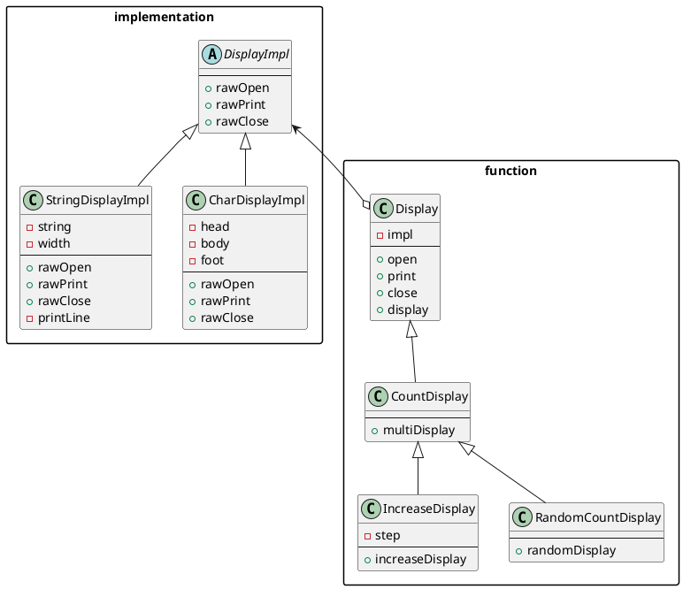

# Bridgeパターン

## 概要

「機能のクラス階層」と「実装のクラス階層」を橋渡しするためのパターン。

### 機能のクラス階層

あるクラス`Something`に新しい機能を追加するために`Something`のサブクラス`SomethingGood`クラスを作るときにできる階層構造。

- スーパークラスは基本的な機能を持っている
- サブクラスはスーパークラスに新しい機能を追加する

### 実装のクラス階層

ある抽象クラス`AbstractClass`の抽象メソッドを実装したサブクラス`ConcreteClass`を作るときにできる階層構造。

- スーパークラスは抽象メソッドによってインターフェースを規定している
- サブクラスは具象メソッドによってそのインターフェースを実装する

### クラス階層の分離

「機能のクラス階層」と「実装のクラス階層」とが混在している場合、クラス階層が複雑になり見通しが悪くなる。それぞれのクラス階層を独立させ、その橋渡しをするためのデザインパターンがBridgeパターン。

## サンプルコード

結城浩先生の[増補改訂版Java言語で学ぶデザインパターン入門](https://www.amazon.co.jp/%E5%A2%97%E8%A3%9C%E6%94%B9%E8%A8%82%E7%89%88Java%E8%A8%80%E8%AA%9E%E3%81%A7%E5%AD%A6%E3%81%B6%E3%83%87%E3%82%B6%E3%82%A4%E3%83%B3%E3%83%91%E3%82%BF%E3%83%BC%E3%83%B3%E5%85%A5%E9%96%80-%E7%B5%90%E5%9F%8E-%E6%B5%A9/dp/4797327030)のJavaプログラムをTypeScriptで写経した。

渡した文字に枠を付けて表示するプログラムを、機能のクラス階層と実装のクラス階層に分離して実装している。

```typescript
import { Display } from 'bridge/function/display';
import { StringDisplayImpl } from 'bridge/implementation/stringDisplayImpl';
import { CountDisplay } from 'bridge/function/countDisplay';

describe('bridge', () => {
  test('display', () => {
    const display: Display = new Display(
      new StringDisplayImpl('Hello, Japan.'),
    );
    expect(display.display()).toEqual(`+-------------+
|Hello, Japan.|
+-------------+`);
  });

  test('multi display', () => {
    const display: CountDisplay = new CountDisplay(
      new StringDisplayImpl('Hello, world'),
    );
    expect(display.multiDisplay(5)).toEqual(`+------------+
|Hello, world|
|Hello, world|
|Hello, world|
|Hello, world|
|Hello, world|
+------------+`);
  });
});
```

`StringDisplayImpl`は渡された文字列を加工して別の文字列を作るという**実装のクラス**。`Display`や`CountDisplay`は`StringDisplayImpl`のインターフェースを使って意味のある文字列のかたまりを表示するという**機能のクラス**。

### 実装のクラス

まずは、文字列を加工して別の文字列を作る実装のインターフェースを用意する。

displayImpl.ts

```typescript
export abstract class DisplayImpl {
  public abstract rawOpen(): string;
  public abstract rawPrint(): string;
  public abstract rawClose(): string;
}
```

このインターフェースを使って、実装のクラスを作ったり、機能のクラスから利用したりする。実装のクラスは以下の通り。

stringDisplayImpl.ts

```typescript
import { DisplayImpl } from 'bridge/implementation/displayImpl';

export class StringDisplayImpl extends DisplayImpl {
  private string: string;
  private width: number;
  public constructor(string: string) {
    super();
    this.string = string;
    this.width = string.length;
  }
  public rawOpen(): string {
    return `${this.printLine()}\n`;
  }
  public rawPrint(): string {
    return `|${this.string}|\n`;
  }
  public rawClose(): string {
    return this.printLine();
  }
  private printLine(): string {
    const string: string[] = [];
    string.push('+');
    for (let i = 0; i < this.width; i++) {
      string.push('-');
    }
    string.push('+');

    return string.join('');
  }
}
```

渡された文字列の長さに応じて枠の上辺と下辺を作る`rawOpen`と`rawClose`、渡された文字列の左右にパイプをつけた文字列を作る`rawPrint`を実装している。

### 機能のクラス

実装のクラス階層のインターフェースを使って、機能を提供するクラス。

display.ts

```typescript
import { DisplayImpl } from 'bridge/implementation/displayImpl';

export class Display {
  private impl: DisplayImpl;
  public constructor(impl: DisplayImpl) {
    this.impl = impl;
  }
  public open(): string {
    return this.impl.rawOpen();
  }
  public print(): string {
    return this.impl.rawPrint();
  }
  public close(): string {
    return this.impl.rawClose();
  }
  public display(): string {
    const string: string[] = [];
    string.push(this.open());
    string.push(this.print());
    string.push(this.close());
    return string.join('');
  }
}
```

`rawOpen`などの実装のクラスをそのまま使うだけの`open`などのメソッドと、それらを順番に使って枠付きの文字を作る`display`メソッドを用意している。

複数回表示する機能を用意する場合は以下のような機能のクラスを作る。

countDisplay

```typescript
import { Display } from 'bridge/function/display';
import { DisplayImpl } from 'bridge/implementation/displayImpl';

export class CountDisplay extends Display {
  public constructor(impl: DisplayImpl) {
    super(impl);
  }
  public multiDisplay(times: number): string {
    const string: string[] = [];
    string.push(this.open());
    for (let i = 0; i < times; i++) {
      string.push(this.print());
    }
    string.push(this.close());
    return string.join('');
  }
}
```

### 機能や実装を追加する

#### ランダム回数表示する機能

```typescript
  test('random count display', () => {
    // 毎回ランダムに表示されたらテストにならないので、テストのときは3回に固定
    jest.spyOn(randomModule, 'generateRandomNumber').mockReturnValue(3);

    const display: RandomCountDisplay = new RandomCountDisplay(
      new StringDisplayImpl('Hello, world'),
    );
    expect(display.randomDisplay(5)).toEqual(`+------------+
|Hello, world|
|Hello, world|
|Hello, world|
+------------+`);
  });
```

例えば以上のようなランダム回数表示する機能を追加するときは、機能のクラス階層にクラスを追加する。

randomCountDisplay.ts

```typescript
import { CountDisplay } from 'bridge/function/countDisplay';
import { DisplayImpl } from 'bridge/implementation/displayImpl';
import { generateRandomNumber } from 'bridge/util/generateRandomNumber';

export class RandomCountDisplay extends CountDisplay {
  public constructor(impl: DisplayImpl) {
    super(impl);
  }
  public randomDisplay(times: number): string {
    const random = generateRandomNumber(times);
    return this.multiDisplay(random);
  }
}
```

#### バーを表示する機能

```typescript
  test('print bar', () => {
    const display1: IncreaseDisplay = new IncreaseDisplay(
      new CharDisplayImpl('<', '*', '>'),
      1,
    );
    expect(display1.increaseDisplay(5)).toEqual(`<>
<*>
<**>
<***>
<****>
`);

    const display2: IncreaseDisplay = new IncreaseDisplay(
      new CharDisplayImpl('<', '-', '>'),
      3,
    );
    expect(display2.increaseDisplay(5)).toEqual(`<>
<--->
<------>
<--------->
<------------>
`);
  });
```

以上のように、長さと段数を指定してバーを表示させる機能を作る場合、`DisplayImpl`を使った新しい実装のクラスと`CountDisplay`を使った新しい機能のクラスを用意すれば実現できる。

CharDisplayImpl.ts

```typescript
import { DisplayImpl } from 'bridge/implementation/displayImpl';

export class CharDisplayImpl extends DisplayImpl {
  private head: string;
  private body: string;
  private foot: string;
  public constructor(head: string, body: string, foot: string) {
    super();
    this.head = head;
    this.body = body;
    this.foot = foot;
  }
  public rawOpen(): string {
    return this.head;
  }
  public rawPrint(): string {
    return this.body;
  }
  public rawClose(): string {
    return `${this.foot}\n`;
  }
}
```

`StringDisplayImpl`が行単位でrawOpen/rawPrint/rawCloseを実装していたのに対して、こちらは文字単位でそれらを実装している。

IncreaseDisplay.ts

```typescript
import { DisplayImpl } from 'bridge/implementation/displayImpl';
import { CountDisplay } from './countDisplay';

export class IncreaseDisplay extends CountDisplay {
  private step: number;
  public constructor(impl: DisplayImpl, step: number) {
    super(impl);
    this.step = step;
  }
  public increaseDisplay(level: number): string {
    const string = [];
    let count = 0;
    for (let i = 0; i < level; i++) {
      string.push(this.multiDisplay(count));
      count += this.step;
    }

    return string.join('');
  }
}
```

`CountDisplay`に、長さを指定して表示するメソッド`increaseDisplay`を追加している。

### 機能・実装を追加していった結果

機能・実装を追加していった結果、以下のようなクラス図ができあがった。



右側にある機能のクラス階層、左側に実装のクラス階層、そしてそれらをつなぐブリッジができていることがわかる。

## 感想・考察
